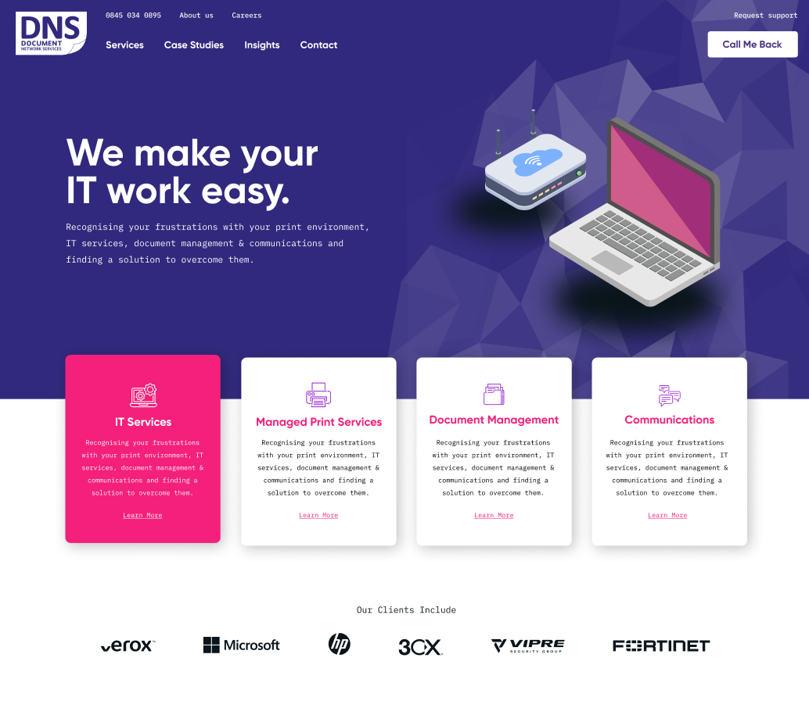
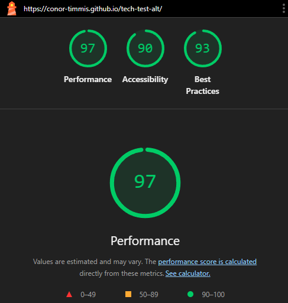

# Tech Test for Alt Design

This repository contains a web project for Alt Design. It uses HTML, CSS, and JavaScript, as well as Tailwind CSS for styling. The project includes personal layout and effect changes to demonstrate design and development skills.

## Live Links

- [Initial Brief (Figma Test)](https://www.figma.com/design/Yg7HazBCnaefNEwgvPFRUo/Alt-Dev-Test?node-id=0-1&p=f&t=sXZpc6RWVV6qVkbR-0)
- [Live Site hosted with GitHub Pages](https://conor-timmis.github.io/tech-test-alt/)

## Technology Choices

I've opted for a simple HTML, CSS, and JavaScript setup for this project, as I felt that using a full web application framework like React would be excessive for display purposes.

## Pre-Warning

For this test, Tailwind CSS was intentionally chosen despite the warning for the CDN link in the console. This decision was made because the project did not need to be a full-fledged application, and is sufficient for what I am putting together. I understand that this choice may not seem ideal, but I am fully aware of the implications and would not use this approach in a full production setting.

I am also aware that I have taken the foundation of the site and made some personal changes, which may include significant or minor adjustments to the layout and added effects to put my personal spin on the original brief. I am only doing this to show what I can do more than "go against the brief" as I would not do so in a professional setting.

## Time Tracking

| Section           | Time Spent |
| ----------------- | ---------- |
| Navigation / Hero | 4h 40m     |
| Case Studies      | 2h         |
| Team Section      | 45m        |
| Contact / Footer  | 3h 30m     |
| **Total**         | 10h 55m    |

## Lighthouse Test

To ensure the site meets modern web standards, I conducted a comprehensive Lighthouse audit focusing on performance, accessibility, and best practices. The SEO metric is excluded it's not required for this demonstration project.

The audit was performed after the final optimisations and would represent the "production-ready" state of the page.

